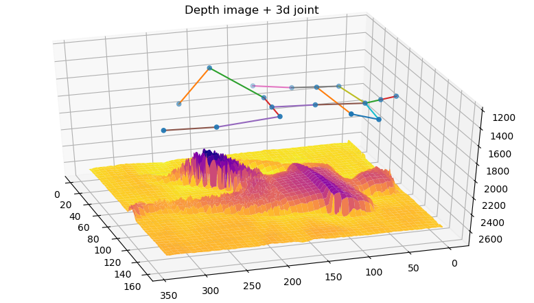

# extended_SLPdataset

What's SLP Dataset
https://arxiv.org/pdf/2008.08735.pdf

### The SLP dataset is a large dataset of sleeping postures.
The SLP dataset is a large dataset of sleeping postures.
The dataset contains a total of 13,770 sleeping posture data.

There are two types of data collected as follows.
- Image data types : RGB image, pressure image, depth image, and IR image per sleeping position (Figure \ref{image_SLP}).
- 2D joint positions : 14 points: right buttock, right knee, right ankle, left buttock, left knee, left ankle, throat, head, left shoulder, left elbow, left wrist, right shoulder, right elbow, right wrist

The measurement conditions for the collected data are the following three methods
- Presence or absence of a futon cover: Three types of covers: a thin blanket, a thick futon, and no cover at all.
- Type of data collection environment: data collected in a home environment and two types of data collected in a hospital environment
- Three sleeping postures: supine, left lateral, and right lateral. 15 measurement data per posture for each subject and each measurement condition.

I have added the correct 3D joint positions to the SLPDataset.

To Do
- [ ] The correct 3D joint positions assigned to the SLPdataset are made public.
